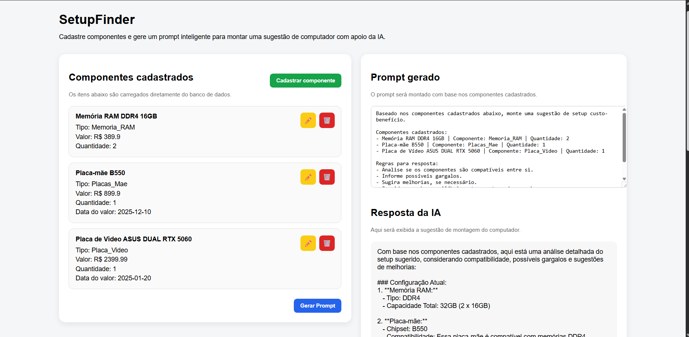

# SetupFinder 🚀
Projeto em desenvolvimento, atualmente em sua V1 funcional.
 
O **SetupFinder** é um projeto em Spring Boot para cadastro de componentes de computador e geração de sugestões de setup com apoio de IA.

Este projeto tem como objetivo estudar a integração com Inteligência Artificial por meio de um sistema de cadastro de componentes de computador, como processador, placa de vídeo, memória RAM, armazenamento e demais peças. Com base nos itens cadastrados, o sistema gera um prompt e solicita à IA uma análise sobre compatibilidade entre os componentes, custo-benefício do setup e possíveis melhorias na configuração.

## ✨ Funcionalidades atuais 

- Dashboard web com Thymeleaf.
- Cadastro manual de componentes.
- Listagem, edição e exclusão de componentes.
- Geração de prompt com base nos componentes cadastrados.
- Exibição da resposta da IA no dashboard.
- Persistência dos dados em PostgreSQL executado em container local

## 🛠️ Tecnologias

## 🚀 Como rodar localmente

O projeto utiliza variáveis de ambiente para configurar a integração com IA e a conexão com o banco H2.

| Variável | Descrição |

| `API_KEY` | Chave utilizada para autenticação na API de IA. |
| `DATABASE_URL` | URL de conexão do banco H2. |
| `DATABASE_USER` | Usuário utilizado na conexão com o banco. |
| `DATABASE_PASSWORD` | Senha utilizada na conexão com o banco. |

> Não versionar chaves, senhas ou credenciais reais no repositório.

## Principais Rotas utilizadas.

Interface:

- GET /setup/listarComponentes
- POST /gerarPrompt

Operações executadas pelo backend:

- POST /setup/adicionarComponente
- PUT /setup/atualizarComponente/{id}
- DELETE /setup/deletarComponente/{id}

Os endpoints CRUD para peças/componentes já estão operando corretamente.

## 📸 Demonstração

Dashboard principal da V1:

