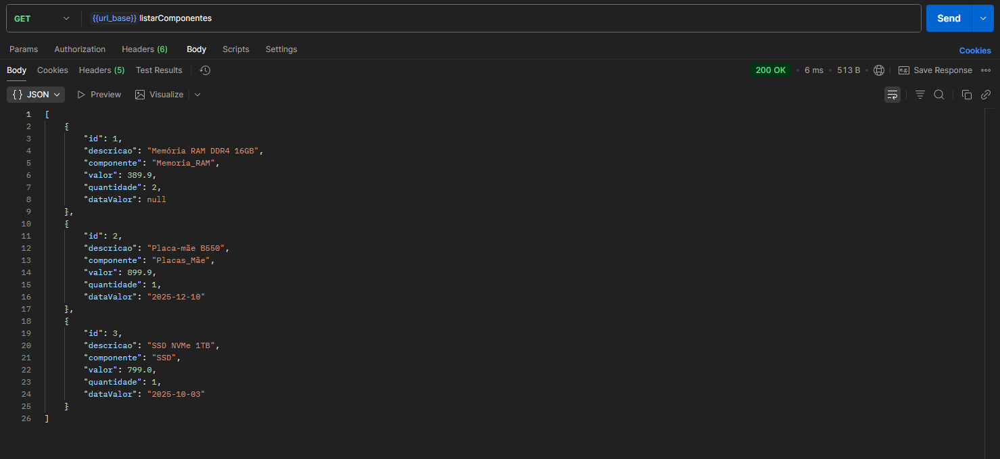

# SetupFinder 🚀

Sistema backend em desenvolvimento que cadastra peças de PC (CPU, GPU, RAM etc.) e planeja sugerir setups completos com melhor custo-benefício, usando lógica de compatibilidade e banco de dados.

**Projeto em fase inicial – ainda em construção e sem funcionalidades completas.**

## ✨ Funcionalidades atuais (em desenvolvimento)
- Cadastro básico de peças
- Conexão com banco H2 para armazenamento temporário

## 🛠️ Tecnologias

**Pretendo alterar o database futuramente quando o projeto tomar mais forma.** (Ex: migrar para PostgreSQL ou outro persistente para produção.)

## 🚀 Como rodar localmente
(O projeto ainda não está pronto para uso externo – essas instruções são só para desenvolvimento pessoal.)

## Endpoints disponíveis (testados no Postman)

Os endpoints CRUD para peças/componentes já estão operando corretamente.

GET /listarComponentes (lista todas as peças)
Retorna array JSON de peças cadastradas.
POST /adicionarComponente (cadastra nova peça)
Body JSON esperado: {
  "descricao": "Placa de Vídeo ASUS DUAL RTX 5060",
  "componente": "Placa_de_vídeo",
  "valor": 2399.99,
  "quantidade": 1,
  "dataValor": "2025-01-20"
}
PUT /atualizarComponente/{id} (atualiza peça)
Retorna mensagem de sucesso
DELETE /pecas/{id} (remove peça)
Retorna mensagem de sucesso.

## 📸 Demonstração 
Aqui vão screenshots reais dos endpoints funcionando (com verificação antes/depois onde aplicável):

### GET - Listando componentes/peças

### POST - Adicionando componente

### PUT - Atualizando componente

Antes da atualização:

Mensagem de Retorno após alterar os dados devidamente:

Resultado da atualização:

### DELETE - Removendo componente

Resultado do delete:

**Nota:** Capturas reais mostrando status de sucesso e respostas. Dados de teste no H2.

